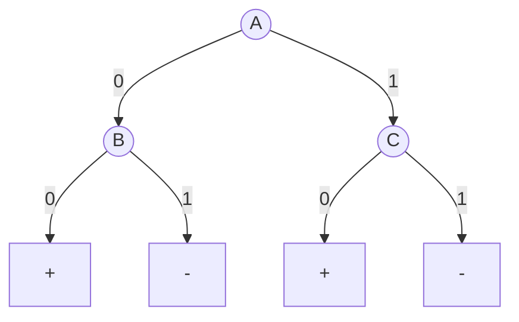

<Callout title="Warning" type="warning">
This article is a work in progress and may contain incomplete information or inaccuracies. Please verify details from reliable sources.
</Callout>

# Data Mining Exercise 9

## Training Set:
|instance|A|B|C|Class|
|--------|--|--|--|-----|
|1|0|0|0|+|
|2|0|0|1|+|
|3|0|1|0|+|
|4|0|1|1|-|
|5|1|0|0|+|
|6|1|0|0|+|
|7|1|1|0|-|
|8|1|0|1|+|
|9|1|1|0|-|
|10|1|1|0|-|

## Validation Set:
|instance|A|B|C|Class|
|--------|--|--|--|-----|
|11|0|0|0|+|
|12|0|1|1|+|
|13|1|1|0|+|
|14|1|0|1|-|
|15|1|0|0|+|

## ข้อ 9: การคำนวณ Generalization Error Rate

โจทย์ให้ Decision Tree มาหนึ่งต้น พร้อมข้อมูล Training (10 แถว) และ Validation (5 แถว) เราต้องคำนวณหาค่าความผิดพลาด (Error Rate) ในรูปแบบต่างๆ

### กฎของต้นไม้ (จากรูป)

**ถ้า A=0 ให้ดู B:**
- B=0 → ทำนาย (+)
- B=1 → ทำนาย (-)

**ถ้า A=1 ให้ดู C:**
- C=0 → ทำนาย (+)
- C=1 → ทำนาย (-)

---

### ตรวจสอบความผิดพลาดบน Training Set (10 ตัวอย่าง)

| # | A | B | C | จริง | ทำนาย | ผล |
|---|---|---|---|------|-------|------|
| 1 | 0 | 0 | 0 | (+) | + | ✅ ถูก |
| 2 | 0 | 0 | 1 | (+) | + | ✅ ถูก |
| 3 | 0 | 1 | 0 | (+) | - | ❌ ผิด |
| 4 | 0 | 1 | 1 | (-) | - | ✅ ถูก |
| 5 | 1 | 0 | 0 | (+) | + | ✅ ถูก |
| 6 | 1 | 0 | 0 | (+) | + | ✅ ถูก |
| 7 | 1 | 1 | 0 | (-) | + | ❌ ผิด |
| 8 | 1 | 0 | 1 | (+) | - | ❌ ผิด |
| 9 | 1 | 1 | 0 | (-) | + | ❌ ผิด |
| 10 | 1 | 1 | 0 | (-) | + | ❌ ผิด |

#### สรุปข้อมูล

- **จำนวนข้อมูลทั้งหมด ($N$):** 10
- **จำนวนที่ทำนายผิด ($e$):** 5 (ข้อที่ 3, 7, 8, 9, 10)
- **จำนวน Leaf Nodes ($k$):** 4 ใบ

---

### 9a. Compute using the Optimistic Approach

วิธีนี้มองโลกในแง่ดี คือใช้ Error บน Training Data ตรงๆ เลย ไม่มีการบวกค่าปรับใดๆ

$$\text{Error Rate} = \frac{e}{N} = \frac{5}{10} = \mathbf{0.5} \, (50\%)$$

---

### 9b. Compute using the Pessimistic Approach

วิธีนี้จะมีการลงโทษ (Penalty) โมเดลที่มีความซับซ้อน (มีใบเยอะ) โดยโจทย์กำหนดให้เพิ่ม Factor 0.5 ต่อ 1 Leaf Node

**สูตร:**

$$\text{Error}(T) = \frac{e + (k \times 0.5)}{N}$$

**แทนค่า:**

$$\text{Error}(T) = \frac{5 + (4 \times 0.5)}{10} = \frac{5 + 2}{10} = \frac{7}{10} = \mathbf{0.7} \, (70\%)$$

---

### 9c. Compute using the Validation Set (Reduced Error Pruning)

วิธีนี้ใช้ข้อมูลชุด Validation มาวัดผลจริงๆ

#### ข้อมูล Validation (5 ตัวอย่าง)

| # | A | B | C | จริง | ทำนาย | ผล |
|---|---|---|---|------|-------|------|
| 11 | 0 | 0 | 0 | (+) | + | ✅ ถูก |
| 12 | 0 | 1 | 1 | (+) | - | ❌ ผิด |
| 13 | 1 | 1 | 0 | (+) | + | ✅ ถูก |
| 14 | 1 | 0 | 1 | (-) | - | ✅ ถูก |
| 15 | 1 | 0 | 0 | (+) | + | ✅ ถูก |

<Callout title="📊 ผลการประเมิน" type="info">
ทำนายผิด **1 ข้อ** (ข้อที่ 12) จากทั้งหมด **5 ข้อ**
</Callout>

$$\text{Error Rate} = \frac{1}{5} = \mathbf{0.2} \, (20\%)$$

---

## ข้อ 11: ข้อจำกัดของ Leave-one-out (Exercise 11)

### สถานการณ์

- ข้อมูลมี **100 ตัว:** 50 Positive (+) และ 50 Negative (-)
- **Attribute เป็นแบบสุ่ม** (ไม่มีประโยชน์ในการทำนายเลย)
- **Classifier ที่ใช้:** Majority Inducer - ทายตามเสียงข้างมากใน Training Set (ถ้าเท่ากัน ให้ทาย +)

---

### 11a. Error rate using Leave-one-out (LOO)

วิธี LOO คือดึงข้อมูลออกทีละ 1 ตัวเพื่อเป็น Test Set แล้ว Train ด้วย 99 ตัวที่เหลือ

#### กรณีที่ 1: ดึงตัว Positive (+) ออกมา Test

- **Training Set เหลือ:** 49 (+) และ 50 (-)
- **Majority Class:** Negative (-) (เพราะ 50 > 49)
- **Model ทำนายว่า:** (-)
- **ผลลัพธ์:** ตัว Test เป็น (+) แต่ Model ทาย (-) → ❌ ทายผิด
- *(เป็นแบบนี้ทั้ง 50 ครั้งที่ดึงตัวบวกออกมา)*

#### กรณีที่ 2: ดึงตัว Negative (-) ออกมา Test

- **Training Set เหลือ:** 50 (+) และ 49 (-)
- **Majority Class:** Positive (+) (เพราะ 50 > 49)
- **Model ทำนายว่า:** (+)
- **ผลลัพธ์:** ตัว Test เป็น (-) แต่ Model ทาย (+) → ❌ ทายผิด
- *(เป็นแบบนี้ทั้ง 50 ครั้งที่ดึงตัวลบออกมา)*

#### สรุป

<Callout title="⚠️ ผลลัพธ์" type="warn">
ผิดทุกครั้งทั้ง 100 รอบ
</Callout>

$$\text{Error Rate} = \frac{100}{100} = \mathbf{1.0} \, (100\%)$$

---

### 11b. Error rate using 2-fold Stratified Cross-validation

วิธีนี้แบ่งข้อมูลเป็น 2 กองเท่าๆ กัน โดยรักษาสัดส่วน Class ไว้ (Stratified)

#### การแบ่ง Fold

- **Fold 1:** 25 (+), 25 (-)
- **Fold 2:** 25 (+), 25 (-)

#### รอบที่ 1: Train ด้วย Fold 1 / Test ด้วย Fold 2

- **Training (Fold 1):** 25 (+), 25 (-) → จำนวนเท่ากัน
- **กฎ Tie-breaking:** ถ้าเท่ากันให้ทาย (+)
- **Test (Fold 2):** มี 25 (+) และ 25 (-)
- **Model ทาย (+) ทั้งหมด** → ถูก 25 ตัว, ผิด 25 ตัว (พวกที่เป็นลบ)

#### รอบที่ 2: Train ด้วย Fold 2 / Test ด้วย Fold 1

- **Training (Fold 2):** 25 (+), 25 (-) → จำนวนเท่ากัน → ทาย (+)
- **Test (Fold 1):** มี 25 (+) และ 25 (-)
- **Model ทาย (+) ทั้งหมด** → ถูก 25 ตัว, ผิด 25 ตัว

#### สรุป

<Callout title="📊 ผลลัพธ์" type="info">
ผิดรวม **50 ตัว** จากทั้งหมด **100 ตัว**
</Callout>

$$\text{Error Rate} = \frac{50}{100} = \mathbf{0.5} \, (50\%)$$

---

### 11c. Which method is more reliable?

#### คำตอบ

<Callout title="✅ 2-fold Stratified Cross-validation เชื่อถือได้มากกว่า" type="success">
More reliable
</Callout>

#### เหตุผล

เนื่องจากโจทย์บอกว่าข้อมูลเป็นแบบสุ่ม (Purely random) ดังนั้น Model ควรจะมีโอกาสทายถูกแค่เดามั่ว หรือ 50% (Error rate = 0.5)

**Leave-one-out ให้ Error 100%**
- ผิดเพี้ยนไปจากความเป็นจริงมาก
- เพราะโครงสร้างของ LOO ในเคสนี้ทำให้เกิด Bias
- เมื่อดึงคลาสไหนออก คลาสนั้นจะกลายเป็นเสียงส่วนน้อยใน Training set ทันที
- ทำให้ Model ทายสวนทางกับความจริงเสมอ

**2-fold Stratified ให้ Error 50%**
- ตรงกับความคาดหมายทางทฤษฎีสำหรับข้อมูลแบบ Random ครับ