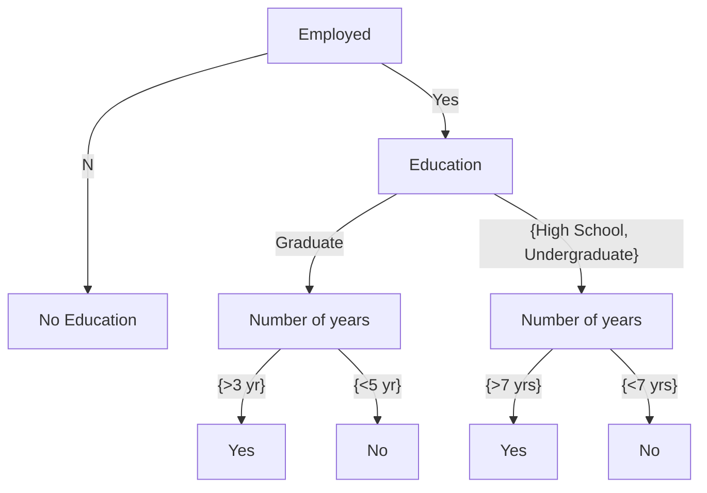

<Callout title="Warning" type="warning">
This article is a work in progress and may contain incomplete information or inaccuracies. Please verify details from reliable sources.
</Callout>  

# What is Data Mining (DM)?
- Data Mining (DM) is the process of discovering patterns, correlations, and insights from large datasets using various techniques from statistics, machine learning, and database systems. It involves analyzing data from different perspectives and summarizing it into useful information that can be used for decision-making, prediction, and understanding complex phenomena.

# Origins of Data Mining
Data Mining, also known as Knowledge Discovery in Databases (KDD), emerged in the late 1980s and early 1990s as a response to the growing need to extract valuable insights from large datasets. The term "data mining" was popularized in the mid-1990s, although the concepts and techniques associated with it have roots in statistics, machine learning, and database systems.

- A key component of the emerging field of data science and data-driven discovery.

# Data Mining Tasks
- **Prediction Methods**: Predicting future trends and behaviors based on historical data.
- Use some variables to predict unknown or future values of other variables.
- **Description Methods**: Summarizing and describing the main characteristics of a dataset.
- Finding human-interpretable patterns that describe the data.

## Table Data Mining Examples
| Tid | Refund | Marital Status | Taxable Income | Cheat |
| --- | ------ | -------------- | -------------- | ----- |
| 1   | No     | Single         | 125000         | No    |
| 2   | No     | Married        | 100000         | No    |
| 3   | Yes    | Single         | 70000          | Yes   |
| 4   | No     | Married        | 120000         | No    |
| 5   | Yes    | Single         | 75000          | Yes   |

- **Classification**: Assigning items to predefined categories based on their attributes.
- **Clustering**: Grouping similar items together based on their attributes without predefined categories.
- **Prediction**: Using historical data to predict future outcomes or trends.
- **Association Rule Learning**: Discovering interesting relationships between variables in large datasets.
- **Anomaly Detection**: Identifying unusual patterns or outliers in data that do not conform to expected behavior.

# Prediction Modeling: Classification

| Tid | Employed | Level of Education | #Years at present address | Credit Worthy |
| --- | -------- | ------------------ | ------------------------- | ------------- |
| 1   | Yes      | Graduate           | 5                         | Yes           |
| 2   | Yes      | High School        | 2                         | No            |
| 3   | No       | Undergraduate      | 1                         | No            |
| 4   | Yes      | High School        | 10                        | Yes           |

