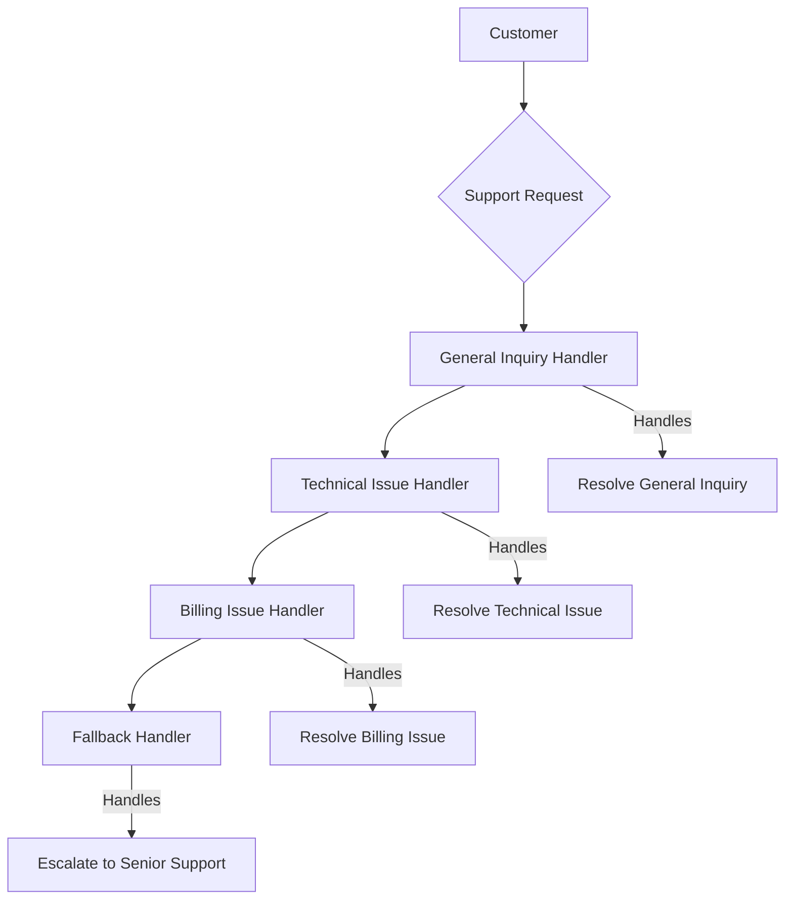

<Callout title="Warning" type="warning">
This article is a work in progress and may contain incomplete information or inaccuracies. Please verify details from reliable sources.
</Callout>

# Definition
The Chain of Responsibility is a behavioral design pattern that allows passing request along the chain of potential handlers until one of them handles the request.

