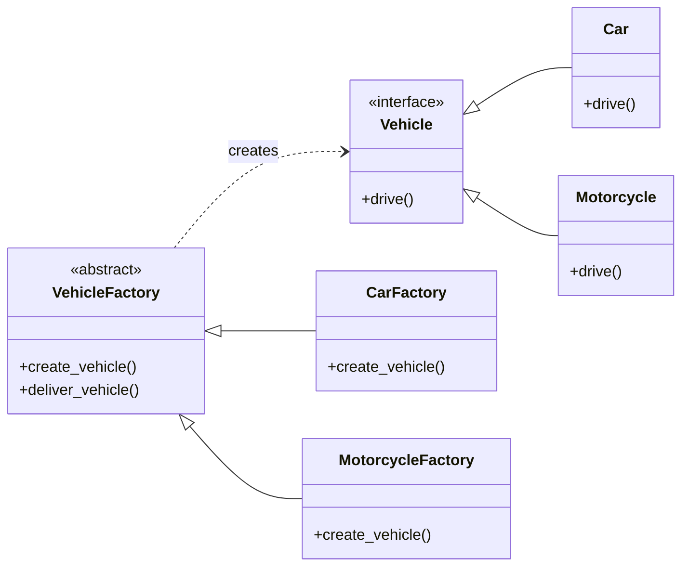

<Callout title="Warning" type="warning">
This article is a work in progress and may contain incomplete information or inaccuracies. Please verify details from reliable sources.
</Callout>
## Definition
The Factory Method is a creational design pattern that provides an interface for creating objects in a superclass, but allows subclasses to alter the type of objects that will be created.


```py
# Product Interface
class Vehicle:
    def drive(self):
        raise NotImplementedError

# Concrete Products
class Car(Vehicle):
    def drive(self):
        return "Driving a car."

class Motorcycle(Vehicle):
    def drive(self):
        return "Riding a motorcycle."

# Creator Interface (Abstract Factory)
class VehicleFactory:
    def create_vehicle(self):
        raise NotImplementedError

    def deliver_vehicle(self):
        vehicle = self.create_vehicle()
        return f"Delivering: {vehicle.drive()}"

# Concrete Creators
class CarFactory(VehicleFactory):
    def create_vehicle(self):
        return Car()

class MotorcycleFactory(VehicleFactory):
    def create_vehicle(self):
        return Motorcycle()

# Client Code
if __name__ == "__main__":
    car_factory = CarFactory()
    print(car_factory.deliver_vehicle())

    motorcycle_factory = MotorcycleFactory()
    print(motorcycle_factory.deliver_vehicle())
```