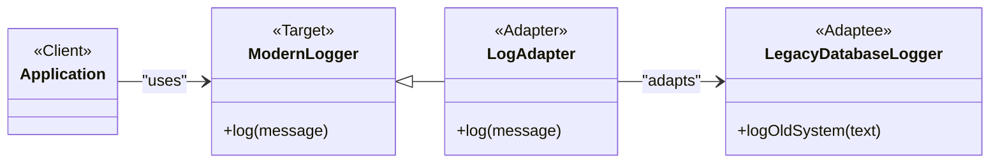

<Callout title="Warning" type="warning">
This article is a work in progress and may contain incomplete information or inaccuracies. Please verify details from reliable sources.
</Callout>
## Definition
The Adapter Pattern is a structural design pattern that allows objects with incompatible interfaces to work together. It acts as a bridge between two incompatible interfaces by wrapping one interface with another.

