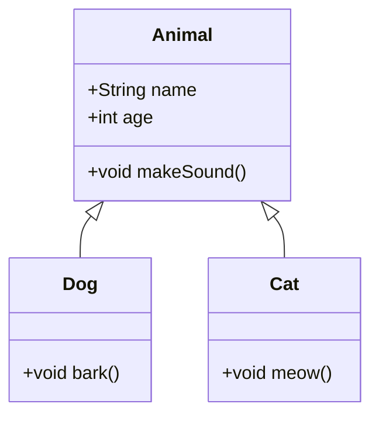

## Introduction to Computer Science
- Computer Science is the study of computers and computational systems. It encompasses a wide range of topics, including algorithms, data structures, programming languages, software development, and more.

## JavaScript Example
```js
function helloWorld() {
  console.log("Hello, World!");
}
```
## Files

import { File, Folder, Files } from 'fumadocs-ui/components/files';

<Files>
  <Folder name="app" defaultOpen>
    <File name="layout.tsx" />
    <File name="page.tsx" />
    <File name="global.css" />
  </Folder>
  <Folder name="components">
    <File name="button.tsx" />
    <File name="tabs.tsx" />
    <File name="dialog.tsx" />
  </Folder>
  <File name="package.json" />
</Files>

{/* ```files
project
├── src
│   ├── index.js
│   └── utils
│       └── helper.js
├── package.json
``` */}

## Mermaid Diagram



<Mermaid
  chart="graph TD;
    A[Start] --> B{Is it working?};
    B -- Yes --> C[Celebrate];
    B -- No --> D[Debug];
    D --> B;
    C --> E[End];"
/>

<Mermaid
  chart="
graph TD;
subgraph AA [Consumers]
A[Mobile app];
B[Web app];
C[Node.js client];
end
subgraph BB [Services]
E[REST API];
F[GraphQL API];
G[SOAP API];
end
Z[GraphQL API];
A --> Z;
B --> Z;
C --> Z;
Z --> E;
Z --> F;
Z --> G;"
/>

<Cards>
  <Card title="Algorithms" description="Study of step-by-step procedures for calculations." />
  <Card title="Data Structures" description="Organizing and storing data efficiently." />
  <Card title="Programming Languages" description="Different languages used to write software." />
  <Card title="Software Development" description="Process of creating and maintaining applications." />
</Cards>